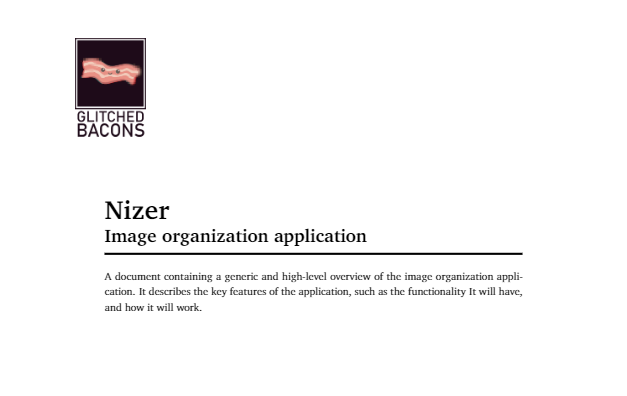

## Nizer Project
This project was created for the course *Software Engineering* in the 5th semester of the full-time course in Computer Science. 

A gif showing how the application works

### Goal of the project

The main goal was an application that allows to cluster photos. More can be found in the specification, which was the main part of this project.

Application Specification (<a href="docs/readme/specification.pdf">click to view</a>).

## Vendors

### Used Frameworks
* QT Library
* GTest & GMock

### Used software
* Lunacy - for making UI prototypes
* Modelio Open Source 4.1 - for UML diagrams

## Authors
* [Dawid Grobert](https://github.com/Notiooo)
* [Julia Boczkowska](https://github.com/JuliaBoczkowska)